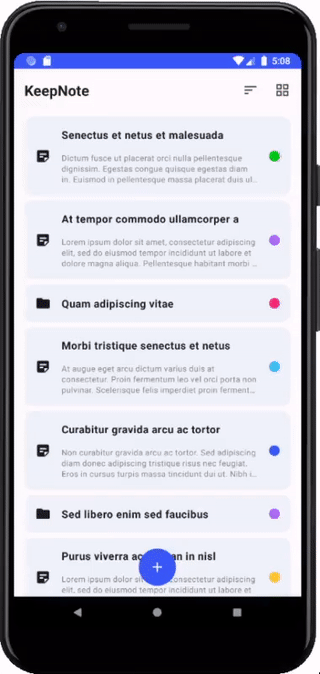
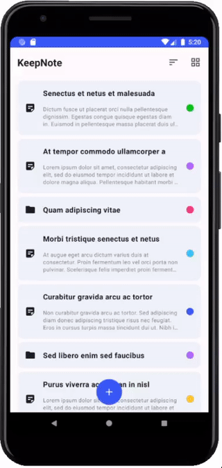
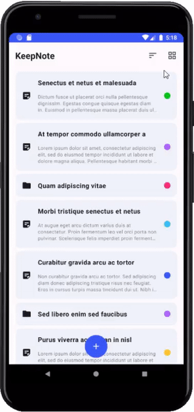
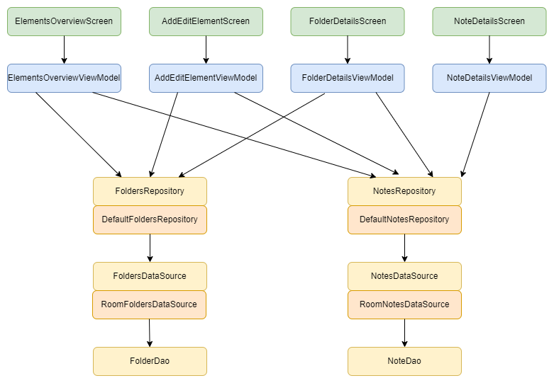

# KeepNote

Android app for storing notes. They can be organized into folders.

&nbsp;

&nbsp;

&nbsp;

## Architecture

&nbsp;

## Features

- create, update, delete note/folder
- organize notes into folders
- sort notes and folders
- share note
- list/grid view

## Tools

- Compose
- Room 
- Hilt
- JUnit, Mockito, Turbine, Robolectric, Jacoco
